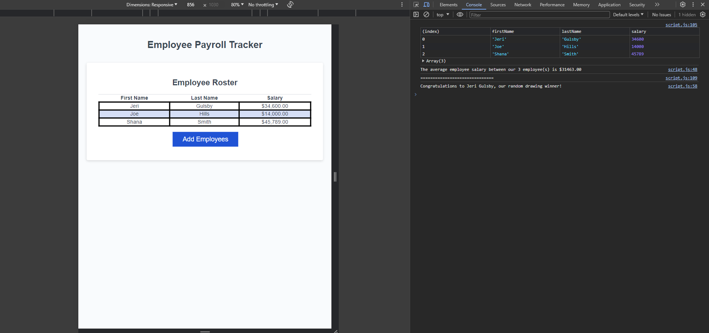

# Employee Payroll Tracker

## Description
This is a simple webpage application that enables a payroll manager to view and manage employee payroll data. By pressing the "Add Employees" number, the application will prompt the user to enter employee information. At the end, the application will ask the user to confirm whether or not they want to add another employee to the payroll. If yes, then the application will loop through the same prompts. If no, then the application will display all the employees first names, last names, and salaries in a table sorted alphabetically by last name. 

In the console it will log the average salary between the number of employees on the payroll. Followed by logging the name of a random employee draw winner from the payroll generated by the application. 

## Screenshot

## URL
https://michellebell0.github.io/employee-payroll-tracker/